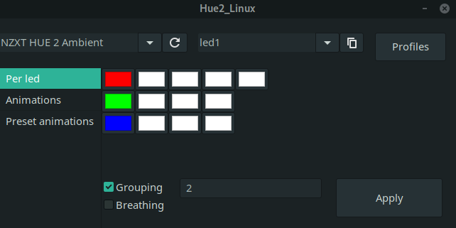
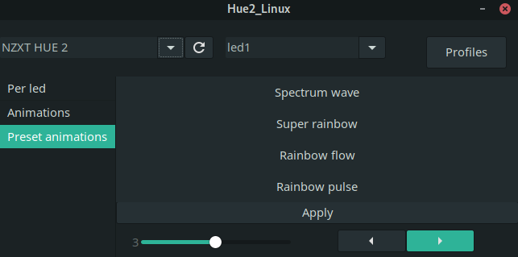

# Hue2_Linux - A cross-platform controller for the NZXT Hue2 RGB lights

Hue2_Linux allows for easy control of Hue2 lights via a GUI interface.
As it is developed using Gtk, it is cross-platform, although primarily made for linux users due to NZXT Cam's lack of compatibility.

At current, this is the only GUI program that supports both the Hue2 and the Hue2 Ambient.
It has by far easiest method for controlling these lights per led.

It uses drivers from the python module [liquidctl](https://github.com/jonasmalacofilho/liquidctl/); These require superuser permissions to work.

## Features
Features include: 
- Per led control, with the ability to group leds
- Easy customisability of animations (colours, speed, direction, marquee length etc.)
- The ability to save profiles for later use
- Lightweight and easy to use

## Screenshots

